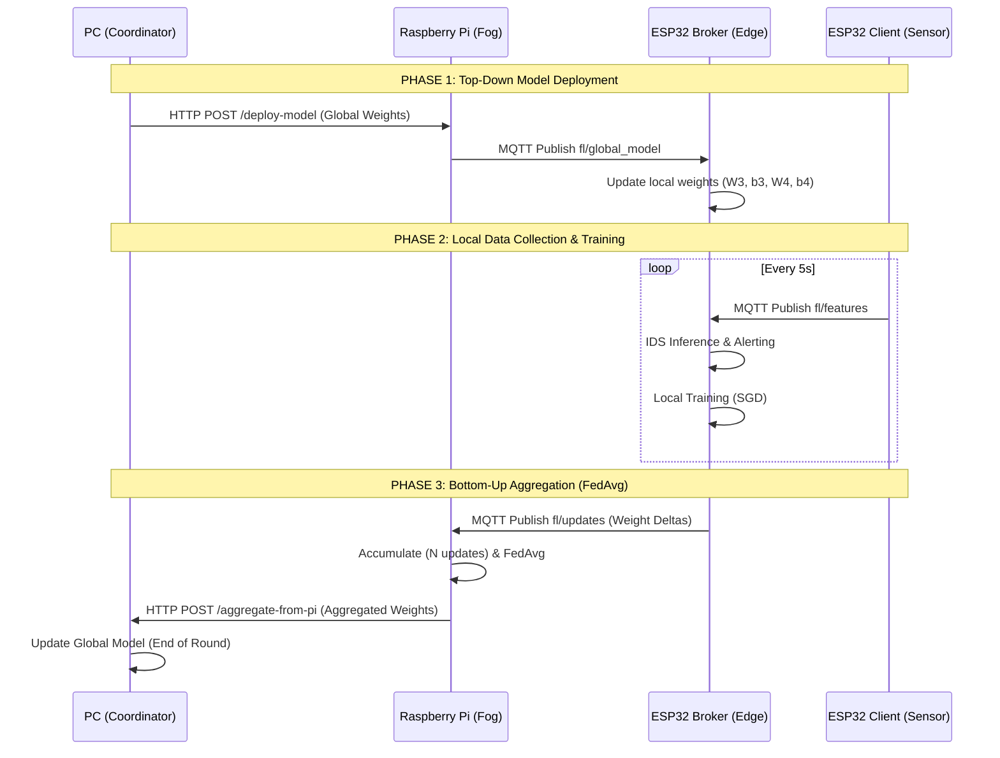

# Hierarchical Federated Learning (HFL) Architecture

## Goal
Transform the existing bottom-up architecture into a true **bidirectional** Hierarchical Federated Learning (HFL) system. 
The system will consist of 4 layers:
1. **PC (Cloud Coordinator)**: Holds the global model, initiates rounds, pushes the model down, and receives the aggregated updates from the Fog layer.
2. **Raspberry Pi (Fog Aggregator)**: Receives the global model from the PC, broadcasts it to the ESP32s via MQTT, collects local updates from ESP32s, performs FedAvg, and sends the result back to the PC.
3. **ESP32 Broker (Edge Node)**: Receives the global model from the Raspberry Pi, trains locally using data from clients, and sends weight deltas back to the Pi.
4. **ESP32 Client (IoT Sensor)**: Publishes raw data to the ESP32 Broker.

## Bidirectional Architecture Flow



## Proposed Changes
All new files will be created in `src/hfl_v5/` to keep them separate from previous iterations.

### 1. `coordinator_hfl.py` (PC)
- Exposes `GET /start-round` (or a button in the dashboard) to initiate a round.
- Sends an HTTP request to the Raspberry Pi with the current `W3`, `b3`, `W4`, `b4`.
- Exposes `POST /aggregate-from-pi` to receive the FedAvg results.
- Maintains the Dashboard showing the global model evolution.

### 2. `aggregator_hfl.py` (Raspberry Pi)
- Exposes an HTTP endpoint (FastAPI/Flask) to receive `POST /deploy-model` from the PC.
- Upon receiving the model, publishes it via MQTT to `fl/global_model` for the ESP32s.
- Listens on MQTT `fl/updates` for deltas from ESP32s.
- Performs FedAvg and sends `POST /aggregate-from-pi` back to the PC.

### 3. `main_broker_hfl.cpp` (ESP32 Broker)
- Subscribes to `fl/global_model` on the external MQTT broker (Raspberry Pi).
- When a new global model arrives, overwrites its local `W3`, `b3`, `W4`, `b4` and resets `numSamples`.
- Trains locally (SGD) as data arrives.
- Sends deltas to `fl/updates`.

### 4. `main_client_hfl.cpp` (ESP32 Client)
- Remains mostly the same, publishing features to the ESP32 Broker.

El modelo ya tiene entrenadas 10 clases:

| Clase | Nombre | Tipo |
|-------|--------|------|
| 0 | benign | Normal |
| 1 | ddos_ack_fragmentation | DDoS |
| 2 | ddos_http_flood | DDoS |
| 3 | ddos_icmp_flood | DDoS |
| 4 | ddos_tcp_flood | DDoS |
| 5 | dns_spoofing | Spoofing |
| 6 | dos_http_flood | DoS |
| 7 | dos_syn_flood | DoS |
| 8 | dos_tcp_flood | DoS |
| 9 | sql_injection_uploading | Injection |

**Para simular un ataque DoS con jMeter** (que ya hicieron), al inundar la red con peticiones TCP/HTTP:
- Las features como `syn_count`, `ack_count`, `Rate`, `Tot sum`, `Number` se dispararán
- El modelo clasificará la ventana como clase 4 (`ddos_tcp_flood`), 6 (`dos_http_flood`) o 7 (`dos_syn_flood`)
- El Broker ESP32 publicará una alerta MQTT con el tipo de ataque detectado

## Dependencias PlatformIO

```ini
lib_deps =
    mmiscool/sMQTTBroker
    knolleary/PubSubClient@^2.8
    bblanchon/ArduinoJson@^6.21.3
```

## Verification Plan

### Manual Verification
1. Subir [main_broker.cpp](file:///c:/Users/VivoBook/Downloads/microproyecto2/microproyecto%202%20porque%20wtf/src/main_broker.cpp) a una ESP32-S3 y verificar que el AP WiFi aparece y el broker MQTT arranca
2. Subir [main_client.cpp](file:///c:/Users/VivoBook/Downloads/microproyecto2/microproyecto%202%20porque%20wtf/src/main_client.cpp) a otra ESP32-S3 y verificar que se conecta al AP y publica features
3. Verificar en el Serial del Broker que recibe features, hace inferencia, e imprime la clase predicha
4. Correr jMeter para simular DoS y verificar que el broker detecta el ataque (clase ≠ 0)
