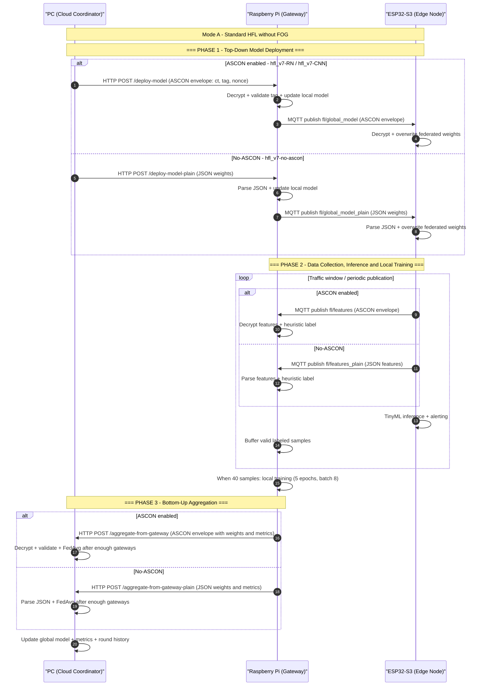
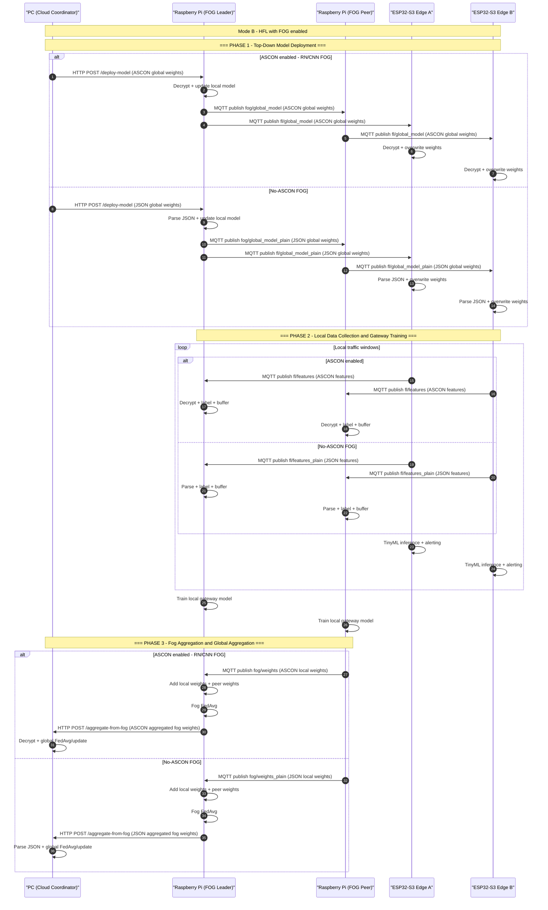

# Implementation Plan v7 - HFL IoT IDS

## Objetivo

La version v7 consolida el sistema de deteccion de intrusiones para IoT como una arquitectura de Hierarchical Federated Learning (HFL) bidireccional, ejecutada sobre una jerarquia PC -> Raspberry Pi -> ESP32-S3.

El objetivo ya no es solo entrenar modelos fuera de linea, sino validar un flujo completo donde:

- El PC mantiene el modelo global y coordina rondas federadas.
- La Raspberry Pi actua como gateway/fog aggregator y entrena con muestras recibidas desde nodos ESP32.
- Los ESP32-S3 ejecutan inferencia TinyML y publican features de trafico MQTT.
- La arquitectura se puede ejecutar con ASCON o sin ASCON.
- La arquitectura se puede ejecutar con agregacion directa PC-gateway o con estrategia FOG entre gateways.
- Se comparan modelos RN/MLP y CNN-1D bajo las mismas condiciones funcionales.

Este archivo reemplaza el plan v5 inicial y documenta lo que realmente quedo implementado en:

- `hfl_v7-RN`
- `hfl_v7-no-ascon`
- `hfl_v7-CNN`
- `NotebooksAndModels`
- `Analisis de Modelos`

## Estado v7 implementado

| Variante | Carpeta | Modelo | Seguridad | Estrategia | Estado |
|---|---|---:|---|---|---|
| RN + ASCON | `hfl_v7-RN` | MLP/RN | ASCON-128 | HFL directo PC-gateway | Implementado |
| RN + ASCON + FOG | `hfl_v7-RN` | MLP/RN | ASCON-128 | FOG leader/peer + PC | Implementado |
| RN sin ASCON | `hfl_v7-no-ascon` | MLP/RN | JSON plano | HFL directo PC-gateway | Implementado |
| RN sin ASCON + FOG | `hfl_v7-no-ascon` | MLP/RN | JSON plano | FOG leader/peer + PC | Implementado |
| CNN-1D + ASCON | `hfl_v7-CNN` | CNN-1D | ASCON-128 | HFL directo PC-gateway | Implementado |
| CNN-1D + ASCON + FOG | `hfl_v7-CNN` | CNN-1D | ASCON-128 | FOG leader/peer + PC | Implementado/probado |

Nota: algunos documentos `ARCHITECTURE.md` heredados pueden conservar nombres o textos de versiones anteriores. La fuente de verdad para este plan son los scripts Python y C++ dentro de las carpetas v7.

## Arquitectura logica

| Capa | Dispositivo | Responsabilidad principal | Implementacion |
|---|---|---|---|
| Cloud | PC | Mantener modelo global, iniciar rondas, recibir actualizaciones, ejecutar FedAvg global y exponer dashboard/API | `server_hfl.py`, `server_hfl_fog.py` |
| Fog/Gateway | Raspberry Pi | Recibir modelo global, distribuirlo al edge, recibir features, etiquetar heuristico, entrenar localmente y enviar pesos | `gateway_hfl.py`, `gateway_hfl_fog.py` |
| Edge | ESP32-S3 | Generar/recibir trafico, calcular features, ejecutar inferencia TinyML y publicar datos al gateway | `main_edge_node_normal.cpp`, `main_edge_node_simulated.cpp` |
| Sensor/Cliente | ESP32-S3 o simulador | Producir trafico MQTT normal o patrones simulados de ataque | Nodos normal/simulated |

## Modelos implementados

### RN/MLP

La variante RN usa una red neuronal densa pequena para clasificacion de trafico IoT.

| Elemento | Valor |
|---|---|
| Entrada | 13 features de flujo |
| Clases | `normal`, `mqtt_bruteforce`, `scan_A` |
| Arquitectura | `13 -> 32 -> 16 -> 8 -> 3` |
| Capas federadas | `W3`, `b3`, `W4`, `b4` |
| Parametros federados | 163 |
| Carpetas | `hfl_v7-RN`, `hfl_v7-no-ascon` |

### CNN-1D

La variante CNN conserva la misma entrada tabular de 13 features, pero la representa como una secuencia unidimensional para aplicar convoluciones.

| Elemento | Valor |
|---|---|
| Entrada | `(13, 1)` |
| Clases | `normal`, `mqtt_bruteforce`, `scan_A` |
| Arquitectura | `Conv1D(32) -> BN -> Conv1D(16) -> BN -> GAP -> Dense(8) -> Dense(3)` |
| Capas federadas | `W_dense1`, `b_dense1`, `W_dense_out`, `b_dense_out` |
| Carpeta | `hfl_v7-CNN/Arquitectura` |

## Datos, features y etiquetado

Los gateways reciben features de trafico desde los ESP32 y construyen ventanas de entrenamiento local.

| Componente | Valor implementado |
|---|---|
| Numero de features | 13 |
| Clases activas | 3 |
| Buffer por actualizacion | 40 muestras |
| Entrenamiento local | 5 epocas |
| Batch size | 8 |
| Optimizador gateway | Adam |
| Learning rate | 0.005 |

La asignacion de etiquetas en gateway se basa en reglas heuristicas sobre las features:

| Condicion | Etiqueta |
|---|---|
| `pkts >= 50` y `numPsh >= 10` | `mqtt_bruteforce` |
| `pkts <= 5`, `meanPktLen <= 50` y `numPsh <= 1` | `scan_A` |
| `pkts <= 30` y `meanPktLen >= 50` | `normal` |
| Otro caso | Muestra descartada |

## Diferencias principales entre variantes

### Con ASCON

ASCON protege los payloads intercambiados entre ESP32, gateway y PC.

| Canal | Payload |
|---|---|
| ESP32 -> Gateway | Features cifradas |
| Gateway -> ESP32 | Pesos globales cifrados |
| Gateway -> PC | Pesos/metricas locales cifradas |
| PC -> Gateway | Pesos globales cifrados |

Formato de mensaje:

```json
{
  "ct": "base64_ciphertext",
  "tag": "base64_tag",
  "nonce": "base64_nonce"
}
```

La validacion del tag ASCON es obligatoria antes de usar datos, features o pesos. Si falla la autenticacion, el mensaje se descarta.

### Sin ASCON

La variante sin ASCON mantiene la misma logica federada y el mismo entrenamiento, pero usa JSON plano. Esta variante permite medir el costo y beneficio de seguridad al comparar contra la ejecucion cifrada.

| Elemento | Con ASCON | Sin ASCON |
|---|---|---|
| Features MQTT | `fl/features` cifrado | `fl/features_plain` JSON |
| Modelo MQTT | `fl/global_model` cifrado | `fl/global_model_plain` JSON |
| Endpoint gateway -> PC | `/aggregate-from-gateway` | `/aggregate-from-gateway-plain` |
| Endpoint PC -> gateway | `/deploy-model` | `/deploy-model-plain` |
| Verificacion de integridad | Tag ASCON | No aplica |
| Modelo/entrenamiento | Igual | Igual |

### Con FOG

La estrategia FOG agrega una capa intermedia de coordinacion entre gateways. En vez de que todos los gateways reporten directamente al PC, un gateway lider recibe pesos de peers, ejecuta FedAvg fog y envia una actualizacion consolidada al PC.

| Elemento | Sin FOG | Con FOG |
|---|---|---|
| Agregacion local | Cada gateway entrena y reporta al PC | Cada gateway entrena; el lider agrega peers |
| Agregacion global PC | PC espera K gateways | PC puede recibir un cluster fog ya agregado |
| Trafico PC | Mayor, por gateway | Menor, por cluster fog |
| Coordinacion fog | No aplica | `FOG_ROLE=leader` o `FOG_ROLE=peer` |
| Endpoint PC | `/aggregate-from-gateway*` | `/aggregate-from-fog` |
| Topics fog | No aplica | `fog/weights*`, `fog/global_model*`, `fog/ready` |

## Bidirectional Architecture Flow - Standard HFL sin FOG

Este flujo aplica a las variantes donde cada Raspberry Pi reporta directamente al PC. La diferencia principal entre ASCON y no-ASCON es el tipo de payload, los topics y los endpoints.



## Bidirectional Architecture Flow - HFL con FOG

Este flujo aplica cuando se activa la estrategia FOG. La Raspberry Pi lider agrega pesos de gateways peers antes de enviar una actualizacion consolidada al PC.



## Matriz de topics y endpoints

| Variante | ESP32 -> Gateway | Gateway -> ESP32 | Gateway/Peer -> Fog Leader | Fog Leader -> Peer | Gateway/Fog -> PC | PC -> Gateway/Fog |
|---|---|---|---|---|---|---|
| RN ASCON sin FOG | `fl/features` | `fl/global_model` | No aplica | No aplica | `/aggregate-from-gateway` | `/deploy-model` |
| RN sin ASCON sin FOG | `fl/features_plain` | `fl/global_model_plain` | No aplica | No aplica | `/aggregate-from-gateway-plain` | `/deploy-model-plain` |
| CNN ASCON sin FOG | `fl/features` | `fl/global_model` | No aplica | No aplica | `/aggregate-from-gateway` | `/deploy-model` |
| RN ASCON con FOG | `fl/features` | `fl/global_model` | `fog/weights` | `fog/global_model` | `/aggregate-from-fog` | `/deploy-model` |
| RN sin ASCON con FOG | `fl/features_plain` | `fl/global_model_plain` | `fog/weights_plain` | `fog/global_model_plain` | `/aggregate-from-fog` | `/deploy-model` |
| CNN ASCON con FOG | `fl/features` | `fl/global_model` | `fog/weights` | `fog/global_model` | `/aggregate-from-fog` | `/deploy-model` |

## Proceso operacional

### Flujo de una ronda federada sin FOG

1. El PC inicia o mantiene una ronda global con los pesos actuales.
2. El PC envia pesos globales a cada Raspberry Pi.
3. Cada Raspberry Pi actualiza su modelo local.
4. Cada Raspberry Pi reenvia el modelo global a sus ESP32.
5. Los ESP32 ejecutan inferencia local y publican features.
6. El gateway valida/parsea features, etiqueta con reglas heuristicas y acumula muestras.
7. Al completar 40 muestras validas, el gateway entrena localmente.
8. El gateway envia pesos/metricas al PC.
9. El PC espera suficientes actualizaciones y ejecuta FedAvg global.
10. El nuevo modelo global queda listo para la siguiente ronda.

### Flujo de una ronda federada con FOG

1. El PC envia el modelo global solo al FOG leader.
2. El FOG leader distribuye el modelo a peers y ESP32 locales.
3. Cada gateway, leader o peer, entrena con sus muestras locales.
4. Los peers envian pesos locales al FOG leader.
5. El FOG leader agrega su propio modelo con los modelos peers.
6. El FOG leader envia una actualizacion fog agregada al PC.
7. El PC actualiza el modelo global.
8. El siguiente despliegue vuelve a bajar desde PC hacia leader, peers y ESP32.

## Comandos de ejecucion esperados

Los comandos pueden requerir ajustar IPs y variables de entorno segun la red del laboratorio.

### RN/MLP con ASCON, sin FOG

```powershell
python hfl_v7-RN/server_hfl.py
python hfl_v7-RN/gateway_hfl.py
```

ESP32:

- `hfl_v7-RN/main_edge_node_normal.cpp`
- `hfl_v7-RN/main_edge_node_simulated.cpp`

### RN/MLP con ASCON y FOG

```powershell
python hfl_v7-RN/server_hfl_fog.py
$env:FOG_ROLE="leader"; $env:GATEWAY_ID="gateway_fog_A"; python hfl_v7-RN/gateway_hfl_fog.py
$env:FOG_ROLE="peer"; $env:GATEWAY_ID="gateway_fog_B"; python hfl_v7-RN/gateway_hfl_fog.py
```

### RN/MLP sin ASCON, sin FOG

```powershell
python hfl_v7-no-ascon/server_hfl.py
python hfl_v7-no-ascon/gateway_hfl.py
```

ESP32:

- `hfl_v7-no-ascon/main_edge_node_normal.cpp`
- `hfl_v7-no-ascon/main_edge_node_simulated.cpp`

### RN/MLP sin ASCON y con FOG

```powershell
python hfl_v7-no-ascon/server_hfl_fog.py
$env:FOG_ROLE="leader"; $env:GATEWAY_ID="gateway_fog_A"; python hfl_v7-no-ascon/gateway_hfl_fog.py
$env:FOG_ROLE="peer"; $env:GATEWAY_ID="gateway_fog_B"; python hfl_v7-no-ascon/gateway_hfl_fog.py
```

### CNN-1D con ASCON

```powershell
python hfl_v7-CNN/Arquitectura/server_hfl.py
python hfl_v7-CNN/Arquitectura/gateway_hfl.py
```

FOG:

```powershell
python hfl_v7-CNN/Arquitectura/server_hfl_fog.py
$env:FOG_ROLE="leader"; $env:GATEWAY_ID="gateway_fog_A"; python hfl_v7-CNN/Arquitectura/gateway_hfl_fog.py
$env:FOG_ROLE="peer"; $env:GATEWAY_ID="gateway_fog_B"; python hfl_v7-CNN/Arquitectura/gateway_hfl_fog.py
```

ESP32:

- `hfl_v7-CNN/Arquitectura/main_edge_node_normal.cpp`
- `hfl_v7-CNN/Arquitectura/main_edge_node_simulated.cpp`

## Resultados experimentales consolidados

### Desempeno offline

Los modelos se entrenaron y compararon inicialmente fuera de linea usando los scripts y artefactos en `NotebooksAndModels`.

| Modelo | Accuracy | F1 weighted |
|---|---:|---:|
| MLP/RN | 0.9060 | 0.9049 |
| Residual MLP | 0.9055 | 0.9044 |
| CNN-1D | 0.9051 | 0.9041 |
| Tiny Transformer | 0.8903 | 0.8919 |

### Resultados HFL v7

Los analisis temporales y comparativos se consolidaron en `Analisis de Modelos/Completo/` (capa SRE unificada que cubre las 8 variantes en una sola corrida) y en las figuras de resultados del documento final. La capa SRE genera `executive_summary.json`, `transport_sli_summary.csv`, `local_training_sli_summary.csv`, `global_round_sli_summary.csv`, `round_trace_summary.csv`, `canonical_log_events.csv` y `SRE_OBSERVABILITY_SPEC.md`.

| Variante | Intentos | Accuracy final | Loss final | Ronda (s) | GW p95 (ms) | Srv dec p95 (ms) | Overhead (B) |
|---|---:|---:|---:|---:|---:|---:|---:|
| CNN_ASCON_FOG    | 7  | 0.9750 | 0.0910 | 58.61 | 4.53 | 37.47 | 1098 |
| CNN_ASCON_NoFOG  | 8  | 0.9604 | 0.1040 | 58.97 | 4.55 | 24.46 | 1049 |
| CNN_PLAIN_FOG    | 3  | 0.9444 | 0.1190 | 54.86 | 0.16 |  0.00 |    0 |
| CNN_PLAIN_NoFOG  | 3  | 0.9389 | 0.1363 | 52.02 | 0.15 |  0.00 |    0 |
| RN_ASCON_FOG     | 5  | 0.9633 | 0.1124 | 71.13 | 4.37 | 50.47 | 1084 |
| RN_ASCON_NoFOG   | 15 | 0.9381 | 0.1545 | 72.91 | 4.65 | 26.69 | 1050 |
| RN_PLAIN_FOG     | 3  | 0.9000 | 0.2199 | 67.14 | 0.16 |  0.00 |    0 |
| RN_PLAIN_NoFOG   | 14 | 0.9298 | 0.1581 | 51.01 | 0.17 |  0.00 |    0 |
| **Promedio**     | **58** | **0.9437** | **0.1383** | **61.36** | **2.34** | **17.39** | **636** |

Lecturas: ASCON mejora la accuracy promedio en +3.2 pts respecto a PLAIN (filtrado implicito de mensajes corruptos); CNN-1D supera a RN en todas las configuraciones; FOG ayuda a CNN y a RN+ASCON, pero degrada RN+PLAIN (-3 pts). Las figuras del documento final se cortan en ronda 20 para homogeneidad visual; las tablas SRE conservan las 30 rondas registradas.

Figuras relevantes (todas generadas por `sre_completo_analysis.py`):

- `Analisis de Modelos/Completo/global_accuracy_loss.png`
- `Analisis de Modelos/Completo/weight_magnitude_trends.png`
- `Analisis de Modelos/Completo/round_duration.png`
- `Analisis de Modelos/Completo/gateway_accuracy_skew.png`
- `Analisis de Modelos/Completo/transport_latency_p95.png`
- `Analisis de Modelos/Completo/transport_payload_bytes.png`
- `Analisis de Modelos/Completo/class_mix_by_gateway.png`
- Copiadas al documento en `Documento_Final/Rev1__Tesis_Sistemas_Uniandes_2/images/Resultados/Completo/`

## Impacto de ASCON

ASCON cambia la capa de comunicacion, no la estructura del modelo ni la logica de FedAvg.

| Aspecto | Cambio al activar ASCON |
|---|---|
| Confidencialidad | Los pesos y features no viajan en claro |
| Integridad | Cada payload tiene tag autenticado |
| Robustez | Payloads alterados son rechazados |
| Latencia | Aumenta por cifrado/descifrado y serializacion |
| Comparacion experimental | Permite medir costo de seguridad frente a JSON plano |

## Impacto de FOG

FOG cambia la topologia de agregacion. El gateway lider reduce el numero de mensajes directos hacia el PC y permite agregar grupos de gateways antes de enviar al coordinador global.

| Aspecto | Cambio al activar FOG |
|---|---|
| Jerarquia | Pasa de PC -> gateway -> ESP32 a PC -> fog leader -> peers/ESP32 |
| FedAvg | Se ejecuta primero en el fog leader y luego en el PC |
| Escalabilidad | Reduce trafico hacia el PC cuando hay multiples gateways |
| Dependencia | El leader se vuelve componente critico del cluster fog |
| Comparacion experimental | Permite contrastar agregacion directa contra agregacion jerarquica |

## Checklist de verificacion v7

- Confirmar que la variante ASCON usa `fl/features`, `fl/global_model` y payload `{ct, tag, nonce}`.
- Confirmar que la variante no-ASCON usa `fl/features_plain`, `fl/global_model_plain` y JSON plano.
- Confirmar que el ESP32 actualiza pesos despues de recibir modelo global.
- Confirmar que el gateway acumula 40 muestras validas antes de entrenar.
- Confirmar que el gateway descarta mensajes con tag ASCON invalido.
- Confirmar que el PC incrementa ronda despues de recibir suficientes actualizaciones.
- Confirmar que en FOG el peer publica pesos al leader antes de que el leader reporte al PC.
- Confirmar que los CSV/logs de metricas se actualizan por ronda.
- Confirmar que las curvas de accuracy, loss y magnitud de pesos se generan desde `Analisis de Modelos`.
- Confirmar que el documento final usa las matrices comparativas de RN + ASCON, RN sin ASCON y CNN FOG.

## Pendientes recomendados

- Unificar nombres de endpoints en no-ASCON FOG para que el despliegue use explicitamente sufijo `_plain` o documentar que `/deploy-model` recibe JSON plano en ese modo.
- Actualizar o eliminar documentos `ARCHITECTURE.md` heredados que todavia mencionen ASCON dentro de la carpeta no-ASCON.
- Agregar una prueba automatizada minima que valide compatibilidad de payloads ASCON y JSON plano.
- Generar una tabla unica de configuracion por IP/puerto para reproducibilidad en laboratorio.
- Documentar en el paper que la variante Tiny Transformer quedo como comparacion offline y no como implementacion embebida final.
